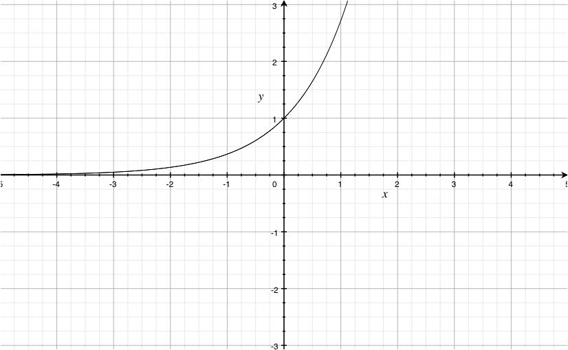
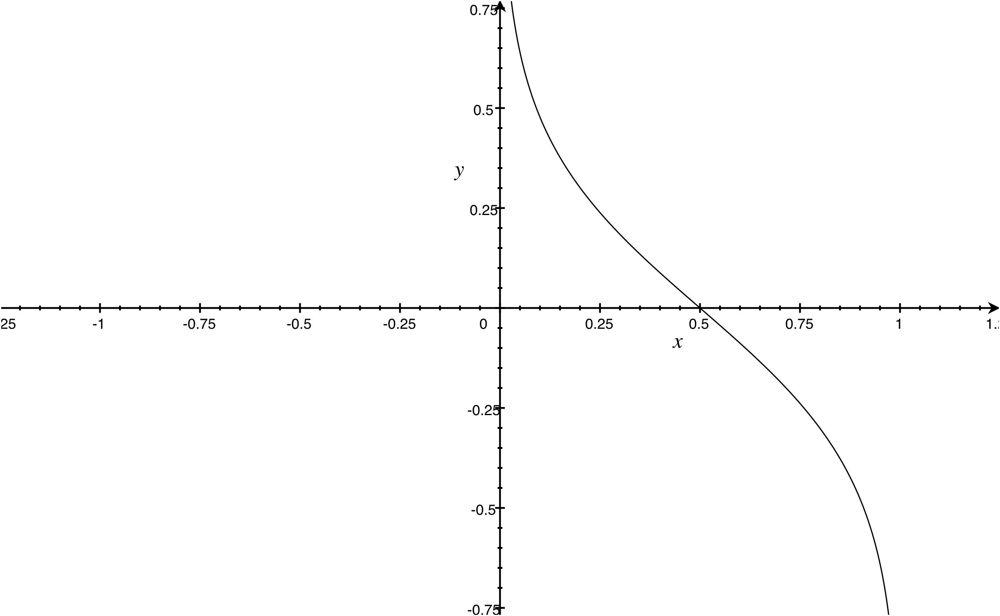

# Adaboost - Classification

**Data** $\lbrace(x_i,y_i)\rbrace_{i=1}^{N}$, where $x_i\in \mathbb{R}^K$, and $y_i\in\lbrace+1,-1\rbrace$.

**Classifier** $G(x) = sign(f(x))=sign \bigg(\sum_{m=1}^{M}\alpha_mG_m(x)\bigg)$, where $G_m(x)$ means the $m$th learner.


## 1. Loss Function

>#### 1.1 0-1 Loss Function

>> * Indicator Function
>> $$
>> I(G_m(x)\neq y)=\left\lbrace\begin{matrix}
>> 0\ if\ G_m(x_i)=y_i
>> \\\\
>> 1\ if\ G_m(x_i) \neq y_i
>> \end{matrix}\right.
>> $$ 
>> 
>> * 0-1 loss function $L(X,y)$:
>> $$
>> L_{0-1}(y, X)=\frac{1}{N} \sum_{i=1}^{N}I(G(x_i)\neq y_i)
>> $$
>> The Total loss is the number of samples that are misclassified.
>> 
>> But, 0-1 Loss Function is not derivative.

 
>#### 1.2 Exponential Loss Function
>> 
>> Exponential loss function $L(X,y)$
>> $$
>> L_{exp}(y,X)=\frac{1}{N}\sum_{i=1}^{N}\exp \bigg(-y_if(x_i)\bigg)
>> $$
>> where $f(x)=\sum_{m=1}^{M}\alpha_mG_m(x)$, is a linear combination of weak learners and their weights. 
>> $f(x)$ and y have relationship as follows:
>> 
>> | y,f(x) | >1    | <1    |
>> |--------|-------|-------|
>> | +1     | True  | False |
>> | -1     | False | True  |
>> 
>> When $y_if(x_i)>0$, the actual and prediction are same; when it's negative, they are different. 
>> 
>> $y=e^x$:
>> 


>#### 1.3 Exponential Loss is the upper bound of 0-1 Loss
>
>>$$
>>\frac{1}{N} \sum_{i=1}^{N}I(G(x_i)\neq y_i)\le \frac{1}{N}\sum_{i=1}^{N}\exp \bigg(-y_if(x_i)\bigg)
>>$$
>>
>>>>where $G(x) = sign(f(x))=sign \bigg(\sum_{m=1}^{M}\alpha_mG_m(x)\bigg)$
>>
>>Proof:
>>
>>>>When $G(x_i)\neq y_i$, then $y_if(x_i)<0$ and $e^{ \big(-y_if(x_i)\big)}\ge 1$. 
>>
>> Hense, if exponential loss of zero is achieved, then the 0-1 loss is zero as well.
>> 

>#### 1.4 Exponential Loss and 0-1 Loss are equivalent
>
>>* Linear Combination of weak learner: $G(x)=\sum_{i=1}^{M}\alpha_mG_m(x)$
>>* The loss function: $L(f(x),y)=e^{-yf(x)},\ where\ y\in\lbrace+1,-1\rbrace$
>>
>>>$E(loss)=P(y=1|x)e^{-f(x)}+P(y=-1|x)e^{+f(x)}$
>>>
>>>$\frac{\partial E(loss)}{\partial f(x)}=-P(y=1|x)e^{-f(x)}+P(y=-1|x)e^{+f(x)}=0$
>>>
$$\begin{align*}
f(x)&=\frac{1}{2}\ln \frac{P(y=1|x)}{P(y=-1|x)}\\\\
sign(f(x))&=sign(\frac{1}{2}\ln\frac{P(y=1|x)}{P(y=-1|x)})\\\\
&=\left\lbrace\begin{matrix}
1\ ,\ if\ P(y=1|x) > P(y=-1|x)
\\\\
-1\ ,\ if\ P(y=1|x) < P(y=-1|x)
\end{matrix}\right.
\end{align*}$$

## 2. Amount of Say & Sample weight

Start from exponential loss function:
$$
L_{exp}(X,y)=\frac{1}{N}\sum_{i=1}^{N}\exp \bigg(-y_if(x_i)\bigg)
$$
>>>>>where $f(x) = \sum_{m=1}^{M}\alpha_mG_m(x)$
>>>>>and $\alpha_m$ is amount of say of $m$th weak learner.

Our target is to minimize the loss,

$$
\min: L_{exp}(X,y)=\frac{1}{N}\sum_{i=1}^{N}\exp \bigg(-y_i\sum_{m=1}^{M}\alpha_mG_m(x_i)\bigg)
$$
Suppose at $m$th recursion, we add a weak classifier $G_m(x)$:
$$\begin{align*}
&L_{exp}(X,y)=\frac{1}{N}\sum_{i=1}^{N}\exp \bigg(-y_i\sum_{j=1}^{m-1}\alpha_jG_j(x_i)-y_i\alpha_mG_m(x_i)\bigg)\\\\
\Rightarrow &L_{exp}(X,y)=\frac{1}{N}\sum_{i=1}^{N}\exp \bigg(-y_i\sum_{j=1}^{m-1}\alpha_jG_j(x_i)\bigg)\cdot\exp\bigg(-y_i\alpha_mG_m(x_i)\bigg)
\end{align*}
$$ 

Since we are using greedy algorithm, we've already chosen the best $\alpha$ for first $m-1$ weak learners. Now we can treat $\exp(-y_i\sum_{j=1}^{m-1}\alpha_jG_j(x_i))$ as a constant.

When we correctly misclassified a sample in $m-1$th recursion, we will increase its weight in the $m$th sample set to train $m$th weak learner. If a sample is misclassified, then $\exp(-y_i\sum_{j=1}^{m-1}\alpha_jG_j(x_i))$ will greater than 1, otherwise less than 1. So it is clear that weight is propotional to $\exp(-y_i\sum_{j=1}^{m-1}\alpha_jG_j(x_i))$.

$$\begin{align*}
&w_i^{(m)} \propto  \exp(-y_i\sum_{j=1}^{m-1}\alpha_jG_j(x_i))\\\\
&\sum_{i=1}^{N}w_i^{(m)}=1
\end{align*}
$$

Now set,

$$
w_i^{(m)}=\frac{\exp(-y_i\sum_{j=1}^{m-1}\alpha_jG_j(x_i))}{Z_m}
$$
Where $Z_m$ is a normalization factor.

$$\begin{align*}
L_{exp}(X,y)&=\frac{1}{N}\sum_{i=1}^{N}w_i^{(m)}Z_m\cdot\exp\bigg(-y_i\alpha_mG_m(x_i)\bigg)\\\\
\Rightarrow\ &=\frac{1}{N}\Big[\sum_{i=1,,G_m(x_i)= y_i}^{N}w_i^{(m)}Z_m\cdot e^{-\alpha_m}+\sum_{i=1,G_m(x_i)\neq y_i}^{N}w_i^{(m)}Z_m\cdot e^{\alpha_m}\Big]\\\\
\Rightarrow\ &=\frac{1}{N}\Big[\sum_{i=1}^{N}w_i^{(m)}Z_m\cdot e^{-\alpha_m}-\sum_{i=1,G_m(x_i)\neq y_i}^{N}w_i^{(m)}Z_m\cdot e^{-\alpha_m}+\sum_{i=1,G_m(x_i)\neq y_i}^{N}w_i^{(m)}Z_m\cdot e^{\alpha_m}\Big]\\\\
\Rightarrow\ &=\frac{Z_m}{N}\Big[e^{-\alpha_m}\sum_{i=1}^{N}w_i^{(m)}-e^{-\alpha_m}\sum_{i=1,G_m(x_i)\neq y_i}^{N}w_i^{(m)}+e^{\alpha_m}\sum_{i=1,G_m(x_i)\neq y_i}^{N}w_i^{(m)}\Big]\\\\
\Rightarrow\ &=\frac{Z_m}{N}\Big[e^{-\alpha_m}\sum_{i=1}^{N}w_i^{(m)}+(e^{\alpha_m}-e^{-\alpha_m})\sum_{i=1,G_m(x_i)\neq y_i}^{N}w_i^{(m)}\Big]\\\\
\Rightarrow\ &=\frac{Z_m}{N}\Big[e^{-\alpha_m}\sum_{i=1}^{N}w_i^{(m)}+(e^{\alpha_m}-e^{-\alpha_m})\sum_{i=1}^{N}w_i^{(m)}I(G_m(x_i)\neq y_i)\Big]\\\\
\end{align*}
$$ 

To minimize this loss function, then:
$$\begin{align*}
&\frac{\partial L_{exp}(X,y)}{\partial \alpha_m}=\frac{Z_m}{N}\Big[-e^{-\alpha_m}\sum_{i=1}^{N}w_i^{(m)}+(e^{\alpha_m}+e^{-\alpha_m})\sum_{i=1}^{N}w_i^{(m)}I(G_m(x_i)\neq y_i)\Big]=0\\\\
\Rightarrow\ &e^{-\alpha_m}\sum_{i=1}^{N}w_i^{(m)} = (e^{\alpha_m}+e^{-\alpha_m})\sum_{i=1}^{N}w_i^{(m)}I(G_m(x_i)\neq y_i)\\\\
\Rightarrow\ &e^{-\alpha_m} = (e^{\alpha_m}+e^{-\alpha_m})\frac{\sum_{i=1}^{N}w_i^{(m)}I(G_m(x_i)\neq y_i)}{\sum_{i=1}^{N}w_i^{(m)}}\\\\
where,\\\\
&\varepsilon_m= \frac{\sum_{i=1}^{N}w_i^{(m)}I(G_m(x_i)\neq y_i)}{\sum_{i=1}^{N}w_i^{(m)}}\ is\ the\ weighted\ error\ rate\ of\ G_m.\\\\
\Rightarrow\ &e^{-\alpha_m} = (e^{\alpha_m}+e^{-\alpha_m})\varepsilon_m\\\\
\Rightarrow\ &e^{-\alpha_m} = e^{\alpha_m}\varepsilon_m+e^{-\alpha_m}\varepsilon_m\\\\
\Rightarrow\ &e^{-\alpha_m}(1-\varepsilon_m) = e^{\alpha_m}\varepsilon_m\\\\
\Rightarrow\ &\frac{(1-\varepsilon_m)}{\varepsilon_m} = e^{2\alpha_m}\\\\
\Rightarrow\ &\alpha_m= \frac{1}{2}\log {\frac{(1-\varepsilon_m)}{\varepsilon_m}} \\\\
\end{align*}
$$

$\alpha_m= \frac{1}{2}\log {\frac{(1-\varepsilon_m)}{\varepsilon_m}}$:
Amount of Say decrease when the error rate increase.


**Notes:**
* 1. Weighted Error rate:

>$\varepsilon_m= \frac{\sum_{i=1}^{N}w_i^{(m)}I(G_m(x_i)\neq y_i)}{\sum_{i=1}^{N}w_i^{(m)}}\ is\ the\ weighted\ error\ rate\ of\ G_m.$

* 2. Update Weights

>$w_i^{(m+1)}=\frac{\exp(-y_i\sum_{j=1}^{m}\alpha_jG_j(x_i))}{Z_{m+1}}=\frac{w_i^{(m)}\exp(-y_i\alpha_mG_m(x_i))}{Z_{m+1}}$ is equivalent to:
$$
w_i^{(m+1)}=
\left\lbrace\begin{matrix}
\frac{w_i^{(m)}\exp(-\alpha_m)}{Z_{m+1}},\ when\ y_i = G_m(x_i)
\\\\
\frac{w_i^{(m)}\exp(\alpha_m)}{Z_{m+1}},\ when\ y_i \neq G_m(x_i)
\end{matrix}\right.
$$
So, when correctly classified, the weight decrease, and when incorrectly classified, the weight increase.

* 3. For good classifier: 
    * Error $\varepsilon_m$ is small.
    * Amount of Say $\alpha_m$ is big.


## 3. Algorithm （Not Done）


**Set**:

>   1. $M$ weak classifiers (e.g. Stump), $G_m(x)\in\lbrace+1,-1\rbrace$

>   2. Exponential Loss Function:

$$
L_{exp}(G(x),y)=\frac{1}{N}\sum_{i=1}^{N}\exp \bigg(-y_if(x_i)\bigg)
$$

**So the algorithm:**

----
Step 1: Initiate the weights of samples.
>for $i$ from 1 to $N$:   

>>$\sum w_i^{(1)}=1$ so that the initial weight $w_{i}^{(1)}=\frac{1}{N}$                 

Step 2: Iteratively train $M$ weak learners. If a sample is correctly classified, then its weight would decrease in the next sample set, vise versa.

>for $m=1$ to $M$: 

>>Fit the $m$th weak classifier to minimize the objective function:
  
$$\begin{align*}
\min\ &loss=\sum_{x}e^{-yF(x)},\ where\ y\in\lbrace+1,-1\rbrace\\\\
&E(loss)=P(y=1|x)e^{-F(x)}+P(y=-1|x)e^{+F(x)}\\\\
& \frac{\partial E(loss)}{\partial F(x)}=-P(y=1|x)e^{-F(x)}+P(y=-1|x)e^{+F(x)}=0\\\\
\Rightarrow\ &e^{2F(x)}=\frac{P(y=1|x)}{P(y=-1|x)}\\\\
& F(x) = \frac{1}{2}\log (\frac{P(y=1|x)}{P(y=-1|x)})\\\\
Set\ Error\ as:\ &e=P(y=-1|x)=Probability\ of\ miss-classification.\\\\
Amount\ of\ say:\ & F(x)=\frac{1}{2}\log (\frac{1-e}{e})
\end{align*}
$$

  
$$
\varepsilon_m=\frac{\sum_{i=1}^{N}w_i^{(m)}I(f_m(x_i)\neq y_i)}{\sum_{i=1}^{N}w_i^{(m)}}
$$

>where $I(f_m(x_i)\neq y_i)=1$ if $f_m(x_i)\neq y_i$, else 0
$$
\alpha_m=\ln \frac{1-\varepsilon_m}{\varepsilon_m},\ Weak\ Leaner\ Weight
$$

>for all $i$:

$$
w_i^{(m+1)}=w_i^{(m)}\exp \Big(-\frac{1}{2}y_i\alpha_mf_m(x_i)\Big)
$$

Final Classifier: 

$$\begin{align*}&g(x)=sign\Big(\sum_{m=1}^{M}\alpha_mf_m(x)\Big)\\\\&F_m(x)=F_{m-1}(x) + \alpha_mf_m(x)
\end{align*}$$

----

Loss Function: **Exponential Loss**

$$Exponential\ L(X,y)=e^{-yf(x)}$$

Set,
    
    
    

①②③④⑤⑥⑦⑧⑨⑩


- [x] 选项一
- [x] 选项二  
- [x][选项3]


```sequence
起床->吃饭: 稀饭油条
吃饭->上班: 不要迟到了
上班->午餐: 吃撑了
上班->下班:
Note right of 下班: 下班了
下班->回家:
Note right of 回家: 到家了
回家-->>起床:
Note left of 起床: 新的一天
```


$$
=>  
$$


#### 1. Weak Learner: Stump, single layer decision tree. It is a binary classifier.

#### 2. Loss Function (Exponential Loss):

$$\begin{align*}
\min\ &loss=\sum_{x}e^{-yF(x)},\ where\ y\in\lbrace+1,-1\rbrace\\\\
&E(loss)=P(y=1|x)e^{-F(x)}+P(y=-1|x)e^{+F(x)}\\\\
& \frac{\partial E(loss)}{\partial F(x)}=-P(y=1|x)e^{-F(x)}+P(y=-1|x)e^{+F(x)}=0\\\\
\Rightarrow\ &e^{2F(x)}=\frac{P(y=1|x)}{P(y=-1|x)}\\\\
& F(x) = \frac{1}{2}\log (\frac{P(y=1|x)}{P(y=-1|x)})\\\\
Set\ Error\ as:\ &e=P(y=-1|x)=Probability\ of\ miss-classification.\\\\
Amount\ of\ say:\ & F(x)=\frac{1}{2}\log (\frac{1-e}{e})
\end{align*}
$$

#### 3. The better the weak learner, the smaller the $e$ is, and the higher the 


When the weak learner is better, $e$ will be smaller, and 

$
F_m(x)=\sum_{t=1}^{m}\alpha_tf_t(x)=F_{m-1}(x)+\alpha_mf_m(x)
$

where $F_m(x)$ means the $m$-th stump.
