# Conditional Random Field

学习笔记，视频参考：https://www.bilibili.com/video/BV19t411R7QU?p=3

本篇文章大部分转载：https://anxiang1836.github.io/2019/11/05/NLP_From_HMM_to_CRF/

有部分修改。


## 1. 背景知识

### 1.1 硬分类

硬分类：硬分类是指使用**非概率模型**，分类结果就是决策函数结果。
* SVM：Support Vector Machine, max margin classifier， 几何间隔
* LDA：Linear Discriminant Analysis， 类间大，类内小
* PLA：Perceptron Learning Algorithm，误分类驱动

### 1.2 软分类

软分类：软分类是指使用**概率模型**，输入不同类别的概率，通过比较取概率最大的分类。分类两大类：

**1. Generative Model：**

生成模型是对联合概率 (joint probability）$P(x,y)$进行建模

* Naive Bayes：朴素贝叶斯假设
朴素贝叶斯模型假设$X_i\perp X_j |Y\ i\neq j$，任意两个X线性无关。其中$Y\in\lbrace1,0\rbrace$。   
     
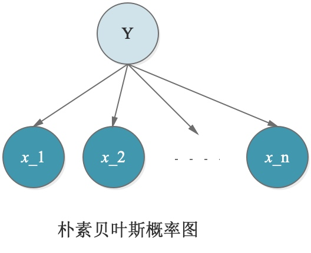
     
 (Source: https://anxiang1836.github.io/2019/11/05/NLP_From_HMM_to_CRF/)
     


* HMM：1. 齐次马尔可夫假设；2. 观测独立性假设
当朴素贝叶斯模型的$Y$转变成一个序列后，就成为了HMM。
    
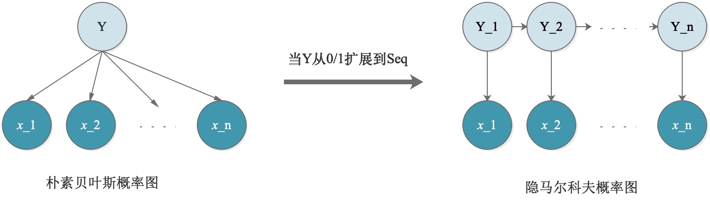
    
(Source: https://anxiang1836.github.io/2019/11/05/NLP_From_HMM_to_CRF/)

* Gaussian Mixture Model
高斯混合模型的隐变量为离散分布，观测变量为高斯分布。同样的，高斯混合模型如果加上时间形成一个序列，就成了HMM。

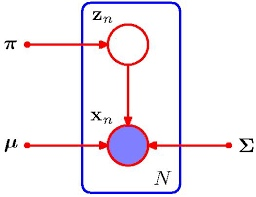

(Source: https://cedar.buffalo.edu/~srihari/CSE574/Chap9/Ch9.2-MixturesofGaussians.pdf)
        

**2. Discriminant Model**
判别模型是对条件概率$P(y|x)$进行建模。
* Logistic/Softmax Regression：最大熵模型，在给定样本均值和方差时，使熵最大的概率分布是高斯分布。具体参考[Exponential Family Distribution](https://github.com/uttgeorge/Machine-Learning-Models/blob/master/Math/Exponential%20Family%20Distribution.md)
* MEMM：Maximum Entropy Markov Model 最大熵马尔可夫模型
    最大熵马尔可夫模型中，每一个隐状态是由前一个隐状态以及它的观测变量决定的。在HMM有观测独立假设，而在MEMM中，观测变量不再相互独立，更加合理。
    **但存在一个问题： label bias problem，因为局部归一化,每一个局部的条件概率$P(y_2|y_1,x_2)$必须是一个概率分布，必须要归一化。**
    
   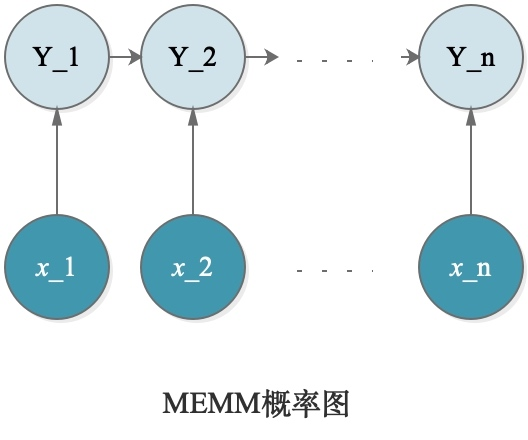
   
   (Source: https://anxiang1836.github.io/2019/11/05/NLP_From_HMM_to_CRF/)
   
        
* CRF：Conditional Random Field
    为了消除标注偏差问题，CRF将MEMM变为无向图，因为无向图具有全局归一化的特性，所以解决了MEMM的问题。
    
    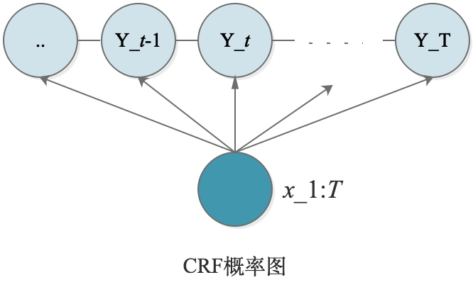
    
     (Source: https://anxiang1836.github.io/2019/11/05/NLP_From_HMM_to_CRF/)


## 2. HMM vs. HEMM

### 2.1 HMM（生成模型）
隐马尔可夫模型：
$$\lambda=(\pi,A,B)$$

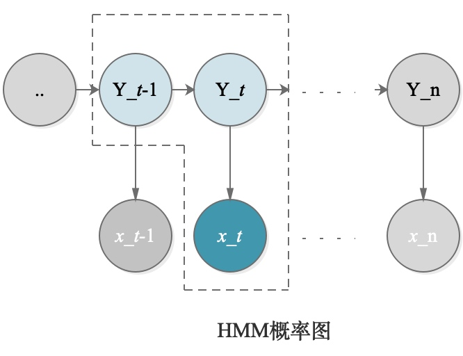

(Source: https://anxiang1836.github.io/2019/11/05/NLP_From_HMM_to_CRF/)


满足两个假设：
1. 齐次一阶马尔可夫假设: 1. 齐次：$P(y_{t+1}|y_t)$始终相同，与时间t无关；2. 一阶：$t+1$时刻隐变量只与$t$时刻隐变量有关，与之前的无关。 $$P(y_t|y_{1:t−1},x_{1:t−1})=P(y_{t}|y_{t−1})$$
2. 观测独立性假设：观测变量只与同时刻的隐状态有关。换句话说：给定$y_t$的时候，$x_t$和$x_{t-1}$是独立的。
$$P(x_t|y_{1:t−1},x_{1:t−1})=P(x_{t}|y_{t})$$

建模对象：$P(X,Y|\lambda)$

$$P(X,Y|\lambda)=\prod_{t=1}^{T} P(x_t,y_t|\lambda)=\prod_{t=1}^{T} P(x_t|y_t,\lambda)P(y_t|y_{t-1}\lambda)$$


### 2.2 MEMM（判别模型）


(Source: https://anxiang1836.github.io/2019/11/05/NLP_From_HMM_to_CRF/)


MEMM打破了观测独立假设，给定$y_t$的时候，$x_t$和$x_{t-1}$不再是独立的。

建模对象：$P(Y|X,\lambda)$

$$P(Y|X,\lambda)=\prod_{t=1}^{T}P(y_t|y_{t-1},x_{1:t},\lambda)$$

## 3. MEMM vs. CRF

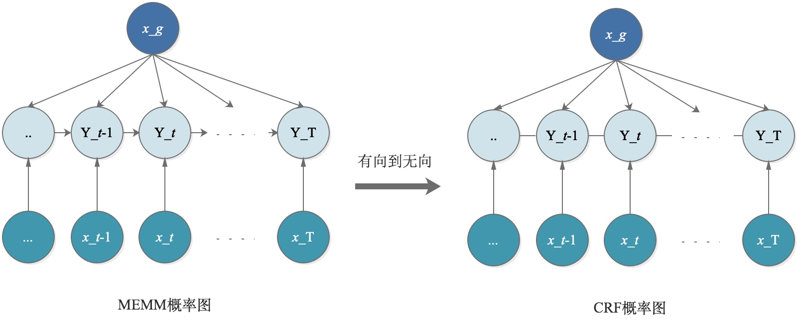

(Source: https://anxiang1836.github.io/2019/11/05/NLP_From_HMM_to_CRF/)

### 3.1 MEMM缺点

这里，把整个输入X分成了2个部分，$X=(x_g,x_{1:T})$。即对Y的影响分成两个部分：全局的影响+Local的影响。

MEMM的主要缺点是： Label Bias Problem. (John Lafferty)

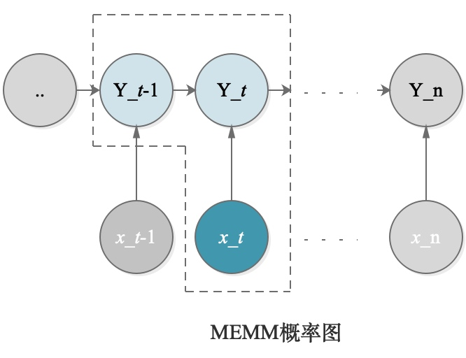

(Source: https://anxiang1836.github.io/2019/11/05/NLP_From_HMM_to_CRF/)

在这个最小单元我们把它当成一个系统，系统从$y_{t−1}$到$y_t$的这样一个转移用数学可以表示成一个函数，是受$y_{t−1}$、$y_t$与$x_t$共同作用的一个函数，系统对外是有一定能量的，这个函数被称为Mass Score，而且是大于0的。但是问题出现在：这个Mass Score被局部归一化了。条件概率熵越小，那么对于观测值的考虑越少。

一个形象的比喻：在t时刻抖动一根绳子，输出能量，如果绳子是均匀的，那么抖动幅度会随着距离越远而逐渐衰减。但如果局部归一化，每一处的抖动都要限制在一定范围之内，就破坏了本来的规律。

一个极端的例子，为了区分两个单词rib和rob：
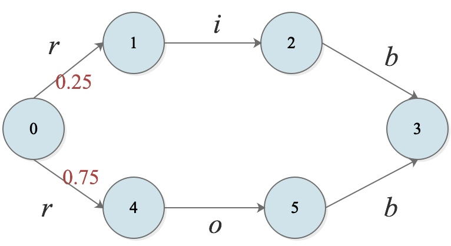

(Source: https://anxiang1836.github.io/2019/11/05/NLP_From_HMM_to_CRF/)

假设在training data中有三个rob，一次rib，那么rib的概率是0.25，而rob是0.75.

由图可以看出，当输入为r后，根据训练结果，选择从0到4的路径，由于局部归一化，0到4的概率为0.75，而从4到5，5到3都必然是o和b，概率为1，熵值为0。 也就是说，无论观测值实际是什么，都不会影响4到5。

对于decoding问题来说，我们想找到一个隐状态序列$Y$，使得已知观测变量$X$的情况下，$Y$的概率最大，假设现在观测到的是rib：
$$
\hat Y = \underset{y_1,y_2,y_3}{argmax}\ P(y_1,y_2,y_3|rib)
$$
由于局部归一化，第一步永远走向4，而之后只能走向5和6，显然与事实不符，这就是Label Bias Problem。 其本质就是：由于归一化，条件概率分布越大，熵值越小，对观测变量的关注就越小。

Conditional distribution with low entropy, take less notice of observation.

因此为了解决局部归一化问题，CRF将有向变为无向，打破了齐次马尔可夫假设，使得全局归一化。


## 4. RF 随机场

“随机场”的名字取的很玄乎，其实理解起来不难。随机场是由若干个位置组成的整体，当给每一个位置中按照某种分布（或者是某种概率）随机赋予一个值之后，其全体就叫做随机场。

以词性标注为例：

假如我们有10个词形成的句子需要做词性标注。这10个词每个词的词性可以在我们已知的词性集合（名词，动词…)中去选择。当我们为每个词选择完词性后，这就形成了一个随机场。

## 5. 马尔科夫随机场(MRF)

马尔可夫随机场(Markov Random Field)，又称概率无向图模型(probabilistic undirected graphical model)。

马尔科夫随机场是随机场的特例，它假设随机场中某一个位置的赋值仅仅与和它相邻的位置的赋值有关，和与其不相邻的位置的赋值无关。

换一种表示方式，把马尔科夫随机场映射到无向图中。此无向图中的节点都与某个随机变量相关，连接着节点的边代表与这两个节点有关的随机变量之间的关系。


```
补充1：

概率无向图模型(probabilistic undirected graphical model)又称为马尔科夫随机场(Markov Random Field)，或者马尔科夫网络。也就是说，两个节点之间并没有明确的前后以及方向关系，两个节点之间存在相互作用，与更远出的点没有关系。

有向图模型通常被称为信念网络(belief network)或者贝叶斯网络(Bayesian network)。

对于这个我们要稍加区分。
```

继续词性标注为例：（还是10个词的句子）

如果我们假设所有词的词性仅与和它相邻的词的词性有关时，这个随机场就特化成一个马尔科夫随机场。

比如第3个词的词性除了与自己本身的位置有关外，只与第2个词和第4个词的词性有关。

```
补充2：

MRF常用于图像方面——图像分割。

图像是一个典型的马尔科夫随机场，在图像中每个点可能会和周围的点有关系有牵连，但是和远处的点或者初始点是没有什么关系的，离这个点越近对这个点的影响越大。

这个很好理解，图像中这个像素点是黑色的，那个很有可能周围也是黑色的像素，但是并不能够推断出距离这个像素点远的像素点们也是黑色的。

当然这个附近，也就是这个领域的范围和大小，是由我们自己去决定的。
```

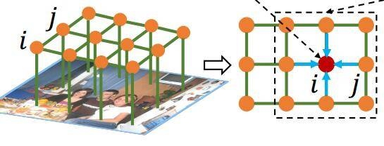

### 5.1 MRF因子分解定理
$$\begin{align*}
P(x)&=\frac{1}{Z}\prod_{i=1}^{K}\Psi(x_{c_i}),x\in \mathbb{R}^p\\\\
通常指定\Psi&函数为指数函数\exp,可改写为:\\\\
&=\frac{1}{Z}\prod_{i=1}^{K}\exp[-E_i(x_{c_i})],x\in \mathbb{R}^p\\\\
&=\frac{1}{Z}\exp[\sum_{i=1}^{K}F_i(x_{c_i})],x\in \mathbb{R}^p
\end{align*}
$$
其中，x是个联合概率分布，它的维度是p维；$\Psi$表示势函数，且大于0；表示能量函数；K表示最大团的个数；$c_i$表示第i个最大团。

```
补充：

Q:什么最大团定义？

通俗理解：就是在无向图中，任意一个子图中，每个节点都能相互的连通，我们就成这个子图为最大团。

例如，有4个节点的线性链，[a—b—c—d]。在这个线性链中，最大团的个数就是：3个，即为[a—b],[b—c],[c—d]。
```


## 6. CRF
CRF是马尔科夫随机场的特例，它假设马尔科夫随机场中只有𝑋和𝑌两种变量，𝑋一般是给定的，而𝑌一般是在给定𝑋的条件下我们的输出。这样马尔科夫随机场就特化成了条件随机场。

在我们10个词的句子词性标注的例子中，𝑋是词，𝑌是词性。因此，如果我们假设它是一个马尔科夫随机场，那么它也就是一个CRF。

对于CRF，我们给出准确的数学语言描述：

设X与Y是随机变量，P(Y|X)是给定X时Y的条件概率分布，若随机变量Y构成的是一个马尔科夫随机场，则称条件概率分布P(Y|X)是条件随机场。

## 7. 线性链条件随机场(Linear-CRF)

注意在CRF的定义中，我们并没有要求𝑋和𝑌有相同的结构。

当𝑋和𝑌有相同结构，即：

$$X=(x_1,x_2,...,x_T),\ Y=(y_1,y_2,...,y_T)$$

这个时候，𝑋和𝑌有相同的结构的CRF就构成了线性链条件随机场。

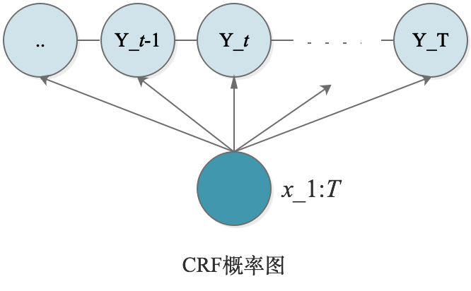

这个就很好理解了，再次回到10个词的句子词性标注问题上。构成句子的词X是有10个，要标注的词性Y也是有10个，这就是一个标准的linear-CRF。


对于Linear-CRF的数学定义是：

设$X=(x_1,x_2,..,x_t,..,x_T),Y=(y_1,y_2,..,y_t,..,y_T)$均为线性链表示的随机变量序列，在给定随机变量序列$X$的情况下，随机变量Y的条件概率分布$P(Y|X)$构成条件随机场，即满足马尔科夫性：

$$P(Y_t|X,y_1,y_2,...,y_T)=P(y_t|X,y_{t-1},y_{t+1})$$

则称，P(Y|X)为线性链条件随机场。

### 7.1 Linear-CRF概率密度函数的参数化形式

从《MRF因子分解定理》部分的公式出发：

$$\begin{align*}
P(x)&=\frac{1}{Z}\exp[\sum_{i=1}^{K}F_i(x_{c_i})],x\in \mathbb{R}^p
\end{align*}
$$

根据CRF的概率图表示，我们可以将其实际的节点带入进去，有：

$$\begin{align*}
P(x)&=\frac{1}{Z}\exp[\sum_{t=1}^{T}F(y_{t-1},y_t,x_{1:T})
\end{align*}
$$

我们单独看线性链中的最大团，根据下图可以很容易看出，对于序列的第$t$个位置，可以分解上式的$F(y_{t−1},y_t,x_{1:T})$分解为3个部分，即：
1. $x_{1:T}$对$y_{t-1}$的影响；
2. $x_{1:T}$对$y_t$的影响
3. $y_{t−1}$、$y_t$间的影响。

但是，由于在$t-1$时刻，已经计算过$x_{1:T}$对$y_{t-1}$的影响，此时可以忽略，于是只用处理2，3项。

数学化表示为：

$$F(y_{t-1},y_t,X_{1:T})=\Delta{y_t,x_{1:T}}+\Delta{y_{t-1},y_{t},x_{1:T}}$$

其中，$\Delta{y_t,x_{1:T}}$为状态函数，即表示为在$t$位置上的节点$y_t$状态；$\Delta{y_{t-1},,y_{t},x_{1:T}}$为转移函数，即表示当前节点$y_t$与上一个节点$y_{t−1}$的相关性。

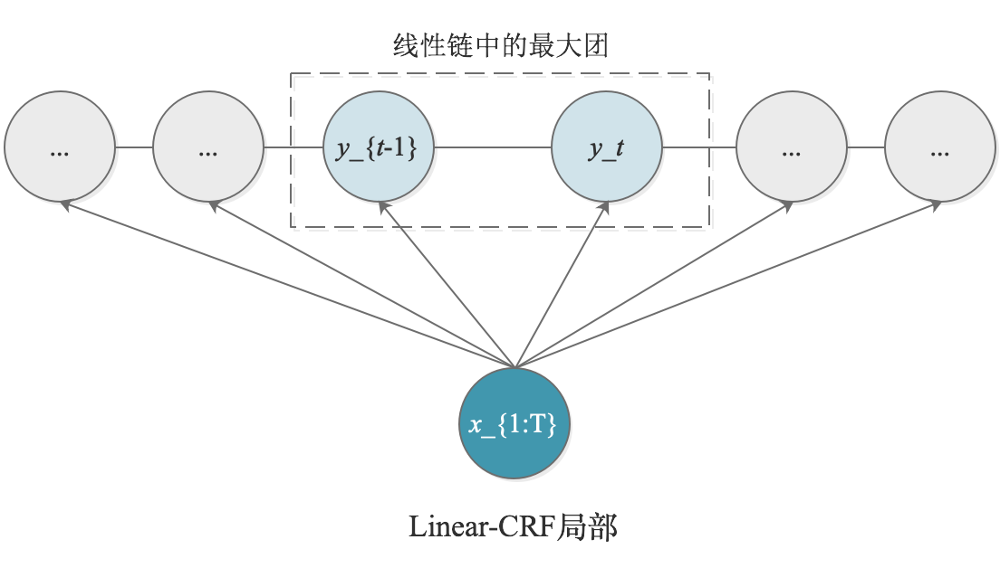

**对于转移函数$\Delta{y_{t-1},y_{t},x_{1:T}}$：**

$$\Delta{y_{t-1},y_{t},x_{1:T}} = \sum_{k=1}^{K}\lambda_k f_k(y_{t-1},y_t, x_{1:T})$$

$\lambda_k$是一个参数，$f_k$ 是一个指示函数/特征函数，表示在满足一个条件的情况下为1，否则为0。例如：
$$f_k(y_{t-1}=名词,y_t=动词, x_{1:T})=1\\\\f_k(y_{t-1}=名词,y_t=助词, x_{1:T})=1$$

**对于状态函数$\Delta{y_{t},x_{1:T}}$**：

$$\Delta{y_{t-1},y_{t},x_{1:T}} = \sum_{l=1}^{L}\eta_l g_l(y_t, x_{1:T})$$

$\eta_l$是一个参数，$g_l$ 是一个指示函数/特征函数，表示在满足一个条件的情况下为1，否则为0。

```
【理解】之所以只有上下文相关的局部特征函数，没有不相邻节点之间的特征函数，是因为我们的linear-CRF满足马尔科夫性。
```

$\lambda,\ \eta$实际上是每一个特征函数/指示函数的权值，表示对这个特征函数的信任度。

$f_k$的权重系数是$\lambda_k$，$g_l$的权重系数是$\eta_l$，则linear-CRF的参数化形式(CRF PDF)为：

$$
P(Y|X)=\frac{1}{Z}\exp \sum_{t=1}^{T}\Big[\sum_{k=1}^{K}\lambda_k f_k(y_{t-1},y_t, x_{1:T})+\sum_{l=1}^{L}\eta_l g_l(y_t, x_{1:T})\Big]
$$

<!--### 7.2 Linear-CRF示例

这里给出一个小例子，方便更好的直观理解linear-CRF。假设输入的句子是三个词，$X=(x_1,x_2,x_3)$。输出的词性标记为$Y=(y_1,y_2,y_3)$。其中，$\forall y_i \in Y,\ y_i \in \lbrace1(名词),2(动词) \rbrace$

这里，只取出值为1的特征函数：-->

### 7.2 Linear-CRF概率密度函数的向量表达

由上一节已知，CRF的概率密度函数是：

$$
P(Y|X)=\frac{1}{Z}\exp \sum_{t=1}^{T}\Big[\sum_{k=1}^{K}\lambda_k f_k(y_{t-1},y_t, x_{1:T})+\sum_{l=1}^{L}\eta_l g_l(y_t, x_{1:T})\Big]
$$

其由两部分组成，一个是状态函数，一个是转移函数。$K,L$是其可以取值的个数。

比如$y_t\in S=\lbrace1(名词),2(动词),3(形容词),4(副词) ... \rbrace$， 总共有$|S|$个不同选择。那么对于转移函数$K$的取值就是$K\le |S|^2$。 因为$y_{t-1}$有$|S|$种可能性，$y_{t}$同样有$|S|$种可能性，二者的排列组合总共有$|S|^2$种。再通过$\lambda_k$来决定排列组合的有用程度。

接下来对$P(Y|X)$进行简化:

1. $Y,X$都是随机变量，$P(Y|X)$实际上应该表示为$P(Y=y|X=x)$。
     
        
    其中$y$是一个列向量，$y\in \mathbb{R}^T$：
    $$
    y=\begin{pmatrix}
    y_1
    \\\\y_2 
    \\\\...
    \\\\y_T 
    \end{pmatrix}
    $$
    
    $x$也是一个列向量，$x\in \mathbb{R}^T$：
    $$
    x=\begin{pmatrix}
    x_1
    \\\\x_2 
    \\\\...
    \\\\x_T 
    \end{pmatrix}
    $$

2. 归一化因子$Z$

    $Z$与$Y$无关，因为作为归一化因子，对所有y求积分，所以无关。那么它与$X$,$\lambda$以及$\eta$有关，所以可以认为$Z$是关于他们的函数Z(x,\lambda\eta)：
    
    其中$\lambda$是$K$维度列向量形式：
    $$
    \lambda=\begin{pmatrix}
    \lambda_1
    \\\\\lambda_2 
    \\\\...
    \\\\\lambda_K 
    \end{pmatrix}
    $$

    $\eta$是$L$维度列向量形式：
    $$
    \eta=\begin{pmatrix}
    \eta_1
    \\\\\eta_2 
    \\\\...
    \\\\\eta_L
    \end{pmatrix}
    $$
    
3. 由于已经把$\lambda$, $\eta$改为向量形式，自然的可以想到把$f$和$g$函数改写成向量形式，以此将连加符号去掉:

    
    $$
    f=\begin{pmatrix}
    f_1
    \\\\f_2 
    \\\\...
    \\\\f_K
    \end{pmatrix}=f(y_{t-1},y_t,X)
    $$
   
    $$
    g=\begin{pmatrix}
    g_1
    \\\\g_2 
    \\\\...
    \\\\g_L
    \end{pmatrix}=g(y_t,X)
    $$ 
    
由此，可以讲概率密度函数改写为：

$$
P(Y=y|X=x)=\frac{1}{Z(x,\lambda\eta)}\exp \sum_{t=1}^{T}\Big[\lambda^T f(y_{t-1},y_t,x)+\eta^T g(y_t,x)\Big]
$$

4. 进一步观察，$t$实际上只与$f$和$g$函数有关，与参数无关，于是可以改写为：
$$
P(Y=y|X=x)=\frac{1}{Z(x,\lambda\eta)}\exp \Big[\lambda^T \sum_{t=1}^{T}f(y_{t-1},y_t,x)+\eta^T \sum_{t=1}^{T}g(y_t,x)\Big]
$$

    如何将$\sum_{t=1}^{T}f(y_{t-1},y_t,x),\ \sum_{t=1}^{T}g(y_t,x)$改写为向量形式？
    
    定义一个向量：$\theta=\begin{pmatrix}
        \lambda
        \\\\\eta
        \end{pmatrix}_{K+L}$，一个函数 $H=\begin{pmatrix}\sum_{t=1}^{T}f\\\\\sum_{t=1}^{T}g \end{pmatrix}_{K+L}$
        
**CRF概率密度函数向量形式：**
$$
P(Y=y|X=x)=\frac{1}{Z(x,\theta)}\exp \Big[\theta^T\cdot H(y_{t},y_{t-1},x)\Big]
$$

## 8. Linear-CRF 要解决的3个问题

现有training data: $\lbrace{(x^{(i)},y^{(i)})}\rbrace_{i=1}^{N}$，$x,y$均是T维。也就是在词性标准的例子中，一个句子是一个样本，我们在模型中所标注的$x_1,x_2,..,x_T$是一个样本中的值。

### 8.1 Learning (not finished)

Learning问题就是参数估计$\theta$，即$\hat \theta = argmax \prod_{i=1}^{N} P(y^{(i)}|x^{(i)})$，其中$\theta=\begin{pmatrix}\lambda\\\\\eta\end{pmatrix}_{K+L}$。
        
$$\begin{align*} \hat \theta &= argmax \prod_{i=1}^{N} P(y^{(i)}|x^{(i)})\\\\
\hat \lambda,\hat \eta&= argmax \prod_{i=1}^{N} P(y^{(i)}|x^{(i)})\end{align*}$$
代入概率密度函数的向量表达式：
$$
P(Y=y|X=x)=\frac{1}{Z(x,\lambda,\eta)}\exp \sum_{t=1}^{T}\Big[\lambda^T f(y_{t-1},y_t,x)+\eta^T g(y_t,x)\Big]
$$

通过log转换为求和问题，可得：
$$\begin{align*} 
\hat \lambda,\hat \eta&= argmax \sum_{i=1}^{N} \log  P(y^{(i)}|x^{(i)})\\\\
&=argmax \sum_{i=1}^{N} \Big(- \log  Z(x^{(i)},\lambda^{(i)},\eta^{(i)}) + \sum_{t=1}^{T}\Big[\lambda^T f(y_{t-1}^{(i)},y_t^{(i)},x^{(i)})+\eta^T g(y_t^{(i)},x^{(i)})\Big]\Big)
\end{align*}$$

其中$Z(x^{(i)},\lambda^{(i)}$是一个配分函数，对应了充分统计量的期望：
$$\begin{align*} 
Z(x^{(i)},\lambda^{(i)}&=E[\sum_{t=1}^{T}f(y_{t-1},y_t,x^{(i)})]\\\\
&=\sum_{y}P(y|x^{(i)})\sum_{t=1}^{T}f(y_{t-1},y_t,x^{(i)})\\\\
&=
\end{align*}
$$


### 8.2 Inference

Inference问题是推断边缘概率，Marginal Probability：$P(y_t|x)$，例如词性标注，推断P(y_1=动词|x)。

Now given $P(Y=y,X=x)$, find the solution for $P(y_t=i|x)$

我们把Linear-CRF参数化形式中的初始公式拿过来：

$$P(y|x)=\frac{1}{Z}\prod_{t=1}^{T}\Psi_t(y_{t-1},y_t,x_{1:T})$$

此时$P(y|x)$中的y包含了$y_1$到$y_T$的所有取值，我们想要求的是$P(y_t=i|x)$，所以对除了$y_t$以外的项求积分。

$$\begin{align*}
P(y_t=i|x)&=\sum_{y_1,y_2,..,y_{t-1},y_{t+1},..,y_T} P(y|x)\\\\
P(y_t=i|x)&=\sum_{y_1,y_2,..,y_{t-1}}\sum_{y_{t+1},..,y_T} \frac{1}{Z}\prod_{t'=1}^{T}\Psi_{t'}(y_{t'-1},y_{t'},x_{1:T})\\\\
P(y_t=i|x)&=\sum_{<y_1,y_{t-1}>}\sum_{<y_{t+1},y_T>} \frac{1}{Z}\prod_{t'=1}^{T}\Psi_{t'}(y_{t'-1},y_{t'},x_{1:T})\\\\
\end{align*}
$$

可以看到，如果按照上式进行求解的话，不加任何的技巧，计算量实在是太大了，复杂度极高，实际是不可行的。时间复杂程度为$O(N^T)$. 因此，我们要对式子进行简化。仔细分析一下，尽管后面是一个连乘，但是，每一个乘子的势函数只与2个状态有关，例如：在时刻t=5，那么乘子就应该是$ψ5(y_4,y_5,X)$。所以，我们可以从这里下手，调整运算的次序，进而简化计算的。

下面将公式进行整理展开，展开的思路为，我们以$y_t$为核心点，将序列Y切成2段，$y_0:y_{t−1}$是一段，$y_{t+1}:y_T$是一段：

$$\begin{align*}
P(y_t=i|x)&=\frac{1}{Z} \Delta_左 \Delta_右\\\\
\Delta_左&=\sum_{<y_1,y_{t-1}>}\prod_{t'=1}^{T}\Psi_{t'}(y_{t'-1},y_{t'},x_{1:T})\\\\
&=\sum_{<y_1,y_{t-1}>}\Psi_{1}(y_{0},y_{1},x_{1:T})\cdot \Psi_{2}(y_{1},y_{2},x_{1:T})... \Psi_{t}(y_{t-1},y_{t}=i,x_{1:T})\\\\
\Delta_右&=\sum_{<y_{t+1},y_T>}\prod_{t'=1}^{T}\Psi_{t'}(y_{t'-1},y_{t'},x_{1:T})\\\\
&=\sum_{<y_{t+1},y_T>}\Psi_{t+1}(y_{t}=i,y_{t+2},x_{1:T})\cdot \Psi_{t+2}(y_{t+1},y_{t+2},x_{1:T})... \Psi_{T}(y_{T-1},y_{T}=i,x_{1:T})
\end{align*}
$$

接下来对连乘式进行求和，首先观察$\Delta_左$，$y_{0}$只在$\Psi_1$中，也就是只用对$\Psi_1$求和：$\sum_{y_0}\Psi_1(y_0,y_1,X)$。接下来，$y_1$同时出现在$\Psi_1$和$\Psi_2$中，所以需要叠加求和：$\sum_{y_1}\bigg[\Psi_2(y_1,y_2,X)\bigg(\sum_{y_0}\Psi_1(y_0,y_1,X)\bigg) \bigg]$，以此类推。

但这个形式还需要化简，我们定义一个函数$\alpha$：
$$
\alpha_t(y_t=i|X):\underset{所有势函数的乘积}{\underbrace{{y_1,y_2,...,y_{t-1}}}} \underset{左半部分势函数}{\underbrace{{y_t=i}}}
$$
该函数是势函数的乘积，表示序列位置t的标记是i时，在位置t之后的部分标记序列的非规范化概率。

结合着$△_左$的展开形式和$α_t$的定义，在t-1时：
$$
\alpha_{t-1}(y_{t-1}=j|X):\underset{所有势函数的乘积}{\underbrace{{y_1,y_2,...,y_{t-2}}}} \underset{左半部分势函数}{\underbrace{{y_{t-1}=j}}}
$$

$$\alpha_{t}(y_{t}=i|X)=\sum_{j\in S}\Big(\Psi_{t}(y_{t-1}=j,y_t=i,X)\cdot  \alpha_{t-1}(y_{t-1}=j|X)\Big)$$

这一部分是在t之前的势函数乘积，再定义t位置后的势函数乘积是$\beta_t$:
$$
\beta_t(y_t=i|X):\underset{右半部分势函数}{\underbrace{{y_t=i}}}\underset{所有势函数的乘积}{\underbrace{{y_{t+1},y_{t+2},...,y_{T}}}} 
$$

结合着$△_右$的展开形式和$\beta_t$的定义，在t+1时：
$$
\beta_{t+1}(y_{t+1}=j|X):\underset{右半部分势函数}{\underbrace{{y_{t+1}=j}}}\underset{所有势函数的乘积}{\underbrace{{y_{t+2},y_{t+3},...,y_{T}}}} 
$$

$$\beta_{t}(y_{t}=i|X)=\sum_{j\in S}\Big(\Psi_{t+1}(y_{t+1}=j,y_t=i,X)\beta_{t+1}(y_{t+1}=j|X) \Big)$$

两个公式结合起来：
$$
P(y_t=i|X)= \frac{1}{Z}\alpha_{t}(y_{t}=i|X) \beta_{t}(y_{t}=i|X)
$$


<!--3. Conditional Probability: 生成模型 ？？？？？？？-->

### 8.3 Decoding

Decoding问题是找到最大后验概率(MAP)，也叫MAP Inference。

$$\hat y =argmax P(y|x)$$

Vitebi.

## References

* https://www.bilibili.com/video/BV19t411R7QU?p=3
* https://anxiang1836.github.io/2019/11/05/NLP_From_HMM_to_CRF/