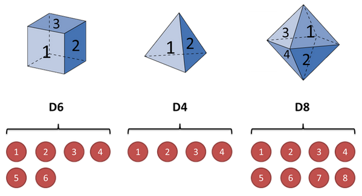
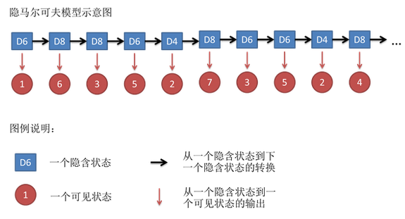
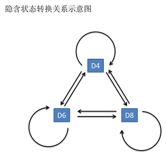
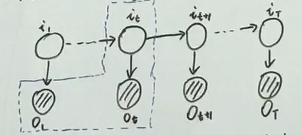

# Hidden Markov Model

## 1. 简介

隐马尔可夫模型(Hidden Markov Model, HMM)是一个经典的概率图模型。主要处理动态模型中，变量之间不是独立同分布 i.i.d，且概率为离散的情况。

## 2.HMM定义

> ### 2.1 时间序列+混合模型
> 如下图所示，假设有三个骰子，一个六面体（D6：1~6），一个四面体（D4：1~4），一个八面体（D8：1~8）。

> 

> 现在我们随机选取一个骰子，假设选取了 D6，并且将 D6 抛掷一次，假设得到数字 1。下一步我们再选取一个骰子，假设选取了 D8，并且将 D8 抛掷一次，假设得到数字 6。按照上面的方法重复多次，将得到两个序列：一个是骰子的序列，另一个是数字的序列，如下图所示：

> 

> 假设 A 每次掷骰子得到一个数字，B 作为观测者，只能看到每次得到的数字，而不知道是哪个骰子。我们将骰子的状态序列称为隐含序列，将数字序列称为观测序列。隐含序列具有马尔科夫性，即下一个骰子是 D4、D6 还是 D8，仅由上一个骰子决定，骰子之间的转移概率可以表示为：

> 

> 而观测值由它所对应的隐含状态决定，即假设当前数字为 8，那么可以肯定它对应的隐含状态为骰子 D8，而与它前后的骰子没有关系。

> 上面这个例子涉及到两个序列，一个是具有马尔科夫性的骰子序列，另一个是观测序列，这就是 HMM。

> ### 2.2 定义

> #### 2.2.1 HMM表达式：
> $$
> \lambda = (\pi, A, B)
> $$
> where 
> * $\pi$ is the initial prob distribution
> * $A$ 是一个状态转移矩阵 state transition matrix,
> * $B$ 是一个发射矩阵 Emission matrix

> 我们令：
> 1. $O$表示观测序列：$O=(o_1,o_2,...,o_T)$，序列长度为$T$。
> 2. $I$表示隐状态序列: $I=(i_1,i_2,...,i_T)$
> 3. $V$表示观测状态集合：$V=\lbrace v_1,v2,...,v_M\rbrace$,总共$M$个观测值。
> 4. $Q$表示隐状态集合：$Q=\lbrace q_1,q_2,...,q_N\rbrace$，总共$N$个隐状态观测值。

> #### 2.2.2 $A$状态转移矩阵:
> HMM的一个假设是齐次马尔可夫假设：任意时刻的隐状态只依赖于前一个隐状态。也就是说$t$时刻的隐状态是：$i_t=q_i$，$t+1$时刻的隐状态是：$i_{t+1}=q_j$，$t$ 到$t+1$的状态转移概率a_{ij}可以表示为：
> $$a_{ij}=P（i_{t+1}=q_{j}|i_t=q_i)$$
> 状态转移矩阵表示为：
> $$A=[a_{ij}]$$

> #### 2.2.3 $B$概率发射矩阵：
> HMM的第二个假设是观测独立性：任意时刻的观测状态只依赖于当前时刻的隐状态。$t$时刻的隐状态是$i_t=q_i$，对应的观测状态为$o_t=v_m$，则该时刻下观测状态的条件概率为：
> $$
> b_{i}(k)=P(o_t=v_k|i_t=q_i)
> $$
> 概率发射矩阵可以表示为：
> $$
> B=[b_{i}(k)]
> $$

> #### 2.2.4 $\pi$初始$t=1$时刻的隐状态概率分布：
> $$\pi(n)=P(i_1=q_n)$$
> $$\pi=[\pi(n)]$$

## 3. HMM解决的三个问题

> ### 3.1 Evaluation 评估观测序列的概率
> 已知$\lambda = (\pi, A, B),\ O=(o_1,o_2,...,o_T)$，求$P(O|\lambda)$。

> 常用算法：
> * forward algorithm
> * backward algorithm

> ### 3.2 Learning 参数学习,$\lambda$如何求？
> $\lambda=argmax\ P(O|\lambda)$

> 常用算法：
> * EM
> * Baum Welch

> ### 3.3 Decoding 
> 找到一个隐状态序列，使得$P(I|O)$概率最大。
> $$\hat I = argmax\ P(I|O)$$

> 引申：
> * 预测问题：$P(i_{T+1}|o_1\ o_2\ ...o_T)$
> * 滤波问题：$P(i_{T}|o_1\ o_2\ ...o_T)$

## 4. Evaluation问题

> ### 4.1 暴力解法
> 已知$\lambda = (\pi, A, B),\ O=(o_1,o_2,...,o_T)$，求$P(O|\lambda)$。

> $$\begin{align*}P(O|\lambda)&=\sum_{I} P(I,O|\lambda) \\\\
> &=\sum_{I} P(O|I,\lambda)P(I|\lambda)\end{align*}$$
> 其中，
> $$\begin{align*}P(I|\lambda)&=P(i_1,i_2,...,i_T|\lambda)\\\\
> &=P(i_T|i_1，i_2,...,i_{T-1},\lambda)P(i_1，i_2,...,i_{T-1}|\lambda)\end{align*}$$
> 根据齐次马尔可夫假设，$P(i_T|i_1，i_2,...,i_{T-1},\lambda)=P(i_T|i_{T-1})=a_{i_{T-1},i_{T}}$
> 于是上式可得：
> $$\begin{align*}P(O|\lambda)&=P(i_T|i_1，i_2,...,i_{T-1},\lambda)P(i_1，i_2,...,i_{T-1}|\lambda)\\\\
> &=a_{i_{T-1},i_{T}} a_{i_{T-2},i_{T-1}}...a_{i_{1},i_{2}}\pi(i_1)\\\\
> &=\pi(i_1)\prod_{t=2}^{T}a_{i_{t-1},i_{t}}\end{align*}$$

> $$\begin{align*}P(O|I,\lambda)&=P(o_1,o_2,...,o_T|i_1,i_2,...,i_T,\lambda)\\\\
> &=P(o_T|o_1,o_2,...o_{T-1},i_1,i_2,...,i_T,\lambda)P(o_1,o_2,...o_{T-1}|i_1，i_2,...,i_{T},\lambda)\\\\
> &=P(o_T|i_T)P(o_1,o_2,...o_{T-1}|i_1，i_2,...,i_{T},\lambda)\\\\
> &=b_{i_T}(o_T)b_{i_{T-1}}(o_{T-1})...b_{i_{1}}(o_{1})\\\\
> &=\prod_{t=1}^{T}b_{i_t}(o_t)\end{align*}$$
> 所以，
> $$
> \begin{align*}
> P(O|\lambda)&=\sum_{I} \pi(i_1)\prod_{t=2}^{T}a_{i_{t-1},i_{t}}\prod_{t=1}^{T}b_{i_t}(o_t)\\\\
> &=\sum_{i_{1}}\sum_{i_{2}}...\sum_{i_{T}} \pi(i_1)\prod_{t=2}^{T}a_{i_{t-1},i_{t}}\prod_{t=1}^{T}b_{i_t}(o_t)\\\\
> \end{align*}
> $$
> $T$个求和，每个求和都有$N$种选择，因为有$N$种观测值，时间复杂程度是$O(N^T)$。
> 这个时间复杂程度过高，需要寻找其他办法求解。

> ### 4.2 Forward Algorithm
> 
> 
> 
> 下面我们令在$t$时刻的所有观测状态以及$t$时刻的隐状态的联合概率密度函数为$\alpha$:
> 
> $$\begin{align*}
> \alpha_t(n)&=P(o_1,o_2,...,o_t,i_t=q_n|\lambda)\\\\
> \alpha_T(n)&=P(O,i_T=q_n|\lambda)\\\\\
> P(O|\lambda)&=\sum_{n=1}^{N} P(O,i_T=q_n|\lambda)\\\\
> &=\sum_{n=1}^{N} \alpha_T(n)
> \end{align*}$$
> 
> 再进一步，我们发现，
> 
> $$\begin{align*}
> \alpha_t(n_{t})&=P(o_1,o_2,...,o_t,i_t=q_{n_{t}}|\lambda)\\\\
> \alpha_{t+1}(n_{t+1})&=P(o_1,o_2,...,o_t,o_{t+1},i_{t+1}=q_{n_{t+1}}|\lambda)
> \end{align*}
> $$
> 把$\alpha_t(n_{t})$代入，
> $$\begin{align*}
> \alpha_{t+1}(n_{t+1})&=\sum_{n=1}^{N}P(o_1,o_2,...,o_t,o_{t+1},i_t=q_{n_{t}},i_{t+1}=q_{n_{t+1}}|\lambda)\\\\
> &=\sum_{n=1}^{N}P(o_{t+1}|o_1,o_2,...,o_t,i_t=q_{n_{t}},i_{t+1}=q_{n_{t+1}},\lambda)P(o_1,o_2,...,o_t,i_t=q_{n_{t}},i_{t+1}=q_{n_{t+1}}|\lambda)
> \end{align*}
> $$
> 因为观测独立性假设，$o_{t+1}$只与$i_{t+1}=q_{n_{t+1}}$相关，于是上式变为：
> $$
> \begin{align*}
> \alpha_{t+1}(n_{t+1})&=\sum_{n=1}^{N}P(o_{t+1}|i_{t+1}=q_{n_{t+1}})P(o_1,o_2,...,o_t,i_t=q_{n_{t}},i_{t+1}=q_{n_{t+1}}|\lambda)\\\\
> &=\sum_{n=1}^{N}P(o_{t+1}|i_{t+1}=q_{n_{t+1}})P(i_{t+1}=q_{n_{t+1}}|o_1,o_2,...,o_t,i_t=q_{n_{t}},\lambda)P(o_1,o_2,...,o_t,i_t=q_{n_{t}}|\lambda)\\\\
> &=\sum_{n=1}^{N}b_{t+1}(n_{t+1})P(i_{t+1}=q_{n_{t+1}}|i_t=q_{n_{t}})P(o_1,o_2,...,o_t,i_t=q_{n_{t}}|\lambda)\\\\
> &=\sum_{n=1}^{N}b_{t+1}(o_{t+1})\cdot a_{i_{t},i_{t+1}}\cdot \alpha_t(o_{t})\\\\
> \end{align*}
> $$
> 由此得到前向算法：
> $$
> \alpha_{t+1}(n_{t+1})=\sum_{n=1}^{N}b_{t+1}(o_{t+1})\cdot a_{i_{t},i_{t+1}}\cdot \alpha_t(n_{t})\\\\
> $$
> 算法的时间复杂程度为：$O(TN^2)$

> ### 4.3 Backward Algorithm

> 后向算法与前向算法类似，但后向算法使用的观测状态不同。在$t$时刻，后向概率定义为：
> $$\beta_t(n)=P(o_{t+1},o_{t+2},...,o_{T}|i_t=q_n,\lambda)$$
> 后向概率与$t$时刻后的所有观测状态，以及$t$时刻时的隐状态$q_{n_t}$，以及整个HMM模型有关。$n_t$表示在$t$时刻隐状态对应的的类别。

> $$\begin{align*}
> P(O|\lambda)&=P(o_T,o_{T-1},...,o_1|\lambda)\\\\
> &=\sum_{n=1}^{N}P(o_1,o_2,..,o_T|i_{1}=q_{n},\lambda)P(i_{1}=q_{n}|\lambda)\\\\
> &=\sum_{n=1}^{N}P(o_1,o_2,..,o_T|i_{1}=q_{n},\lambda)\pi(n)\\\\
> &=\sum_{n=1}^{N}P(o_1|o_2,o_3,..,o_T,i_{1}=q_{n},\lambda)P(o_2,o_3,..,o_T,|i_{1}=q_{n},\lambda)\pi(n)\\\\
> &=\sum_{n=1}^{N}P(o_1|i_{1}=q_{n})P(o_2,o_3,..,o_T,|i_{1}=q_{n},\lambda)\pi(n)\\\\
> &=\sum_{n=1}^{N}b_{i_1}(o_1)\beta_1(n)\pi(n)
> \end{align*}$$
> 根据齐次马尔可夫假设和观测独立性假设：
> $$\begin{align*}
> \beta_t(n)&=P(o_{t+1},o_{t+2},...,o_{T}|i_t=q_n,\lambda)\\\\
> &=\sum_{m=1}^{N}P(o_{t+1},o_{t+2},...,o_{T},i_{t+1}=q_m|i_t=q_n,\lambda)\\\\
> &=\sum_{m=1}^{N}P(o_{t+1},o_{t+2},...,o_{T}|i_{t+1}=q_m,i_t=q_n,\lambda)P(i_{t+1}=q_m|i_t=q_n,\lambda)\\\\
> &=\sum_{m=1}^{N}P(o_{t+1},o_{t+2},...,o_{T}|i_{t+1}=q_m,\lambda)a_{i_{t+1},i_t}\\\\
> &=\sum_{m=1}^{N}P(o_{t+1}|o_{t+2},...,o_{T},i_{t+1}=q_m,\lambda)P(o_{t+2},...,o_{T}|i_{t+1}=q_m,\lambda)a_{i_{t+1},i_t}\\\\
> &=\sum_{m=1}^{N}P(o_{t+1}|i_{t+1}=q_m)P(o_{t+2},...,o_{T}|i_{t+1}=q_m,\lambda)a_{i_{t+1},i_t}\\\\
> &=\sum_{m=1}^{N}b_{t+1}(o_{t+1})\cdot \beta_{t+1}(m)\cdot a_{i_{t+1},i_t}\\\\
> \end{align*}$$

> 算法时间复杂度：$O(TN^2)$

## 5. Learning

Baum Welch (EM)算法：
$$\theta^{(t+1)}=\underset{\theta}{argmax}\ \int_{Z}\log P(X,Z|\theta)P(Z|X,\theta^{(t)})dZ$$
其中，
* $X$：观测值，对应$O$
* $Z$： 隐变量，对应$I$
* $\theta$： 参数，对应$\lambda$

由此可以将EM公式改写为：
$$\begin{align*}
\lambda^{(t+1)}&=\underset{\theta}{argmax}\ \sum_{I}\log P(O,I|\lambda)P(I|O,\lambda^{(t)})\\\\
&=\underset{\theta}{argmax}\ \sum_{I}\log P(O,I|\lambda)\frac{P(I,O|\lambda^{(t)})}{P(O|\lambda^{(t)})}\\\\
因为\lambda^{(t)}&是一个固定值，对于最后结果没有影响，所以分母可以省略：\\\\
&=\underset{\theta}{argmax}\ \sum_{I}\log P(O,I|\lambda)P(I,O|\lambda^{(t)})\\\\
\end{align*}
$$

现在令 $Q(\lambda,\lambda^{(t)})=\sum_{I}\log P(O,I|\lambda)P(I,O|\lambda^{(t)})$，$\lambda^{(t+1)}=(\pi^{(t+1)},A^{(t+1)},B^{(t+1)})$.
已知：
$$
P(O|\lambda)=\sum_{I} P(O,I|\lambda)=\sum_{i_{1}}\sum_{i_{2}}...\sum_{i_{T}} \pi(i_1)\prod_{t=2}^{T}a_{i_{t-1},i_{t}}\prod_{t=1}^{T}b_{i_t}(o_t)
$$
代入EM公式：

$$\begin{align*}
Q(\lambda,\lambda^{(t)})&=\sum_{I}\log P(O,I|\lambda)P(I,O|\lambda^{(t)})\\\\
&=\sum_{I}\Big[\bigg(\log \pi(i_1)+ \sum_{t=2}^{T} \log a_{i_{t-1},i_{t}}  + \sum_{t=1}^{T} \log b_{i_t}(o_t) \bigg)P(I,O|\lambda^{(t)})\Big]
\end{align*}
$$

第一步，求$\pi^{(t+1)}$：

$$
\pi^{(t+1)}=\underset{\pi}{argmax}\ \sum_{I}\Big[\bigg(\log \pi(i_1)+ \sum_{t=2}^{T} \log a_{i_{t-1},i_{t}}  + \sum_{t=1}^{T} \log b_{i_t}(o_t) \bigg)P(I,O|\lambda^{(t)})\Big]
$$
因为$\sum_{t=2}^{T} \log a_{i_{t-1},i_{t}}  + \sum_{t=1}^{T} \log b_{i_t}(o_t)$与$\pi$无关，可以略去：
$$\begin{align*}
\pi^{(t+1)}&=\underset{\pi}{argmax}\ \sum_{I}\Big[\log \pi(i_1)P(I,O|\lambda^{(t)})\Big]\\\\
&=\sum_{i_{1}}\sum_{i_{2}}...\sum_{i_{T}}\Big[\log \pi(i_1)P(I,O|\lambda^{(t)})\Big]
\end{align*}
$$
因为$\pi(i_1)$只受$\sum_{i_{1}}$影响，$P(I,O|\lambda^{(t)})$通过这一系列（除了$\sum_{i_{1}}$）求和，可以把$I$中从$i_2$开始的所有序列略去：
$$
\begin{align*}
\pi^{(t+1)}&=\sum_{i_{1}}\sum_{i_{2}}...\sum_{i_{T}}\Big[\log \pi(i_1)P(I,O|\lambda^{(t)})\Big]\\\\
&=\sum_{i_{1}}\log \pi(i_1)P(O,i_1=q_n|\lambda^{(t)})\\\\
&=\sum_{n=1}^{N}\log \pi(i_1=q_n)P(O,i_1=q_n|\lambda^{(t)})\\\\
s.t.\ & \ \sum_{n=1}^{N} \pi(i_1=q_n)=1
\end{align*}
$$
转换为有约束的优化问题，通过Lagrange Multiplier：
$$\begin{align*}
L(\pi,\eta)&=\sum_{n=1}^{N}\log \pi(i_1=q_n)P(O,i_1=q_n|\lambda^{(t)})+\eta (\sum_{n=1}^{N} \pi(i_1=q_n)-1)\\\\
令\pi(n )&=\pi(i_1=q_n)\\\\
\frac{\partial \eta}{\partial \pi(n )}&=\frac{P(O,i_1=q_n|\lambda^{(t)})}{\pi(i_1=q_n)}+\eta=0\\\\
&P(O,i_1=q_n|\lambda^{(t)})+\pi(i_1=q_n)\eta=0\\\\
求和：\\\\
&\sum_{n=1}^{N}\Big[P(O,i_1=q_n|\lambda^{(t)})+\pi(i_1=q_n)\eta\Big]=0\\\\
&P(O|\lambda^{(t)})+\eta=0\\\\
&\eta=-P(O|\lambda^{(t)})\\\\
代入原&式得：\\\\
&\pi^{(t+1) }=\frac{P(O,i_1=q_n|\lambda^{(t)})}{P(O|\lambda^{(t)})}\\\\
\end{align*}
$$

## 6. Decoding

Decoding问题是找到一个隐状态序列，使得$P(I|O)$概率最大。
$$\hat I = argmax\ P(I|O)$$

每一个时刻，隐状态都有N种选择，如果有T个时间点，那么总共就有$N^T$种选择。从中选择出一个最大可能的序列。我们利用动态规划来解决，例如假设$1$时刻隐状态是$q_1$，$2$时刻隐状态是$q_2$，那么从$q_1$到$q_2$实际上是一个条件概率$P(q_2|q_1)$，动态规划中，我们通常是寻找最短路径，这里可以把$\frac{1}{P}$类比于距离。当发生概率越大，距离越短，概率越小，距离越大。

接下来使用动态规划来解决此问题，用$\delta_t(n)$代表到达$t$时刻隐状态为$i_t=q_n$，观测变量为$o_{t}$的最短距离/最大概率：

$$\begin{align*}
\delta_t(n)&=\max P(o_1,o_2,...,o_t,i_1,i_2,...,i_{t-1},i_t=q_n)\\\\
\delta_{t+1}(m)&=\max P(o_1,o_2,...,o_{t+1},i_1,i_2,...,i_{t},i_{t+1}=q_m)\\\\
&=\underset{1\le n \le N}{\max} \delta_t(n) a_{i_t,i_{t+1}} b_{i_{t+1}}(o_{t+1})\\\\
\end{align*}
$$

找到到达$t+1$时刻$q_m$状态的最佳路径路径，$\varphi_{t+1}(m)$记录了$t$时刻的最优隐状态：

$$
\varphi_{t+1}(m)=\underset{1\le n \le N}{argmax} \delta_t(n) a_{i_t,i_{t+1}} 
$$

该算法称作Viterbi算法。

## 7. 总结

HMM是一种动态模型，包含序列和混合模型。可以理解为是GMM+序列。

## 8. 应用

自然语言处理，待补充

## References

* https://www.bilibili.com/video/BV1MW41167Rf?p=3
* https://www.cnblogs.com/skyme/p/4651331.html
* https://zhuanlan.zhihu.com/p/78565984