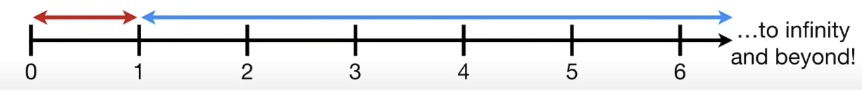

# Logistic Regression

## 1. Intro
In statistics, the logistic model (or logit model) is used to model the probability of a certain class or event existing such as pass/fail, win/lose, alive/dead or healthy/sick. This can be extended to model several classes of events such as determining whether an image contains a cat, dog, lion, etc. Each object being detected in the image would be assigned a probability between 0 and 1 and the sum adding to one.

## 2. Odds, Log(Odds) and Probability

### 2.1 Odds
The odds are the ratio of something happening(i.e. my team winning) to something not happening(i.e. my team not winning).

$$\begin{align*}
    &odds = \frac{X}{N-X}\\\\
    &X:\ Number\ of\ success\\\\
    &N:\ Number\ of\ trails
\end{align*}
$$

### 2.2 Probability

The probability is the ratio of something happening to everything that could happen.

$$\begin{align*}
    &probability = \frac{X}{N}\\\\
    &X:\ Number\ of\ success\\\\
    &N:\ Number\ of\ trails
\end{align*}
$$

### 2.3 The relationship between odds and probability

$$\begin{align*}
    &odds = \frac{p}{1-p}\\\\
    &p:\ Probability\ of\ success\\\\
\end{align*}
$$

### 2.4 Log(Odds)

`Example:
When gambling, if I win once, and loss 6 times, then the odds of winning is 1/6 = 0.15, or if I win once, and loss 100 times, then the odds of winning is 1/100=0.01.
But if I win 10 times, and only loss once, then the odds of winning is 10/1=10.
`

==1. If the odds are against winning, then they will be between 0 and 1.==
==2. If the odds are for winning, then they will be greater than 1.==

The asymmetry makes it difficult to compare the odds for or against winning.

**So we are using log(odds) to make it symmetry.** The odds in favor 6 to 1, then log(6/1)=1.79. The odds are against 1 to 6, then the log(odds) are log(1/6)=-1/79.

The log of the ratio of the probabilities is called the **logit function** and forms the basis for logistic regression.

## 3. Odds Ratio and Log(Odds Ratios)         
# **Statistic Test!!!**

### 3.1 Concept

Odds ratio is not odds, it is a ratio of odds. And similar to the log(odds), log(odds ratios) is normally distributed.

Odds Ratios and Log(Odds Ratios) are like R-Squared - they describe a relationship between two things. And just like R-Squared, you need to determine if this relationship is statistically significant.

### 3.2 Statistical Tests
1. Fisher's Exact Test
2. Chi-square Test
3. Wald Test

## 4. Sigmoid Function

==This is a function that connect linear regression to logistic regression.==

As we mentioned earlier, probability ranges from 0 to 1, while log(odds) ranges from $-\infty$ to $+\infty$. 
We might be able to find a linear relationship between $log(odds)$ and $x$.

$$\begin{align*}
logit(p)=log(odds)=w^Tx+b
\end{align*}
$$

Then we can find the link between log(odds) and probabilities:

$$\begin{align*}
log(\frac{p}{1-p})&=log(odds)\\\\
\frac{p}{1-p}& =e^{log(odds)}\\\\
p&=e^{log(odds)}-p\cdot e^{log(odds)}\\\\
p+p\cdot e^{log(odds)}&=e^{log(odds)}\\\\
p(1+e^{log(odds)})&=e^{log(odds)}\\\\
p&=\frac{e^{log(odds)}}{(1+e^{log(odds)})}\\\\
p&=\frac{1}{1+e^{-log(odds)}}
\end{align*}
$$

* **Sigmoid Function**

    Now replace log(odds) with its linear function:

$$\begin{align*}
p = \sigma(Z)&=\frac{1}{1+e^{-Z}}\\\\
Z&=w^Tx
\end{align*}
$$

## 5. Lost/Cost Function & Maximum Likelihood

### 5.1 Maximum Likelihood

For linear function:

$log(odds) = w^Tx$ is ranging from $-\infty$ to $+\infty$.

For logistic function:

$p = \sigma(w^Tx)=\frac{1}{1+e^{-w^Tx}}$ is ranging from 0 to 1.

In linear regression, we use Lest Square to fit the best model. But for Logistic regression, least square is not applicable. In linear regression, we assume that $y$ follows Normal Distribution, that is $y\sim N(\mu,\sigma^2)$. But in logistic regression, $y$ follows Bernoulli Distribution(0-1), which is a discrete distribution. If we use least square, the lost function will be **non-convex**.

Now, set:

$$\begin{align*}
&p_1: p(y=1|x)=p(x)\\\\
&p_0: p(y=0|x)=1-p(x)
\end{align*}
$$

**Likelihood Function:**

$$\begin{align*}
L(y|x)&=\prod p(x)^y\cdot (1-p(x))^{(1-y)}\\\\
&=\prod p_1^y\cdot p_0^{(1-y)}
\end{align*}
$$

### 5.2 Lost Function

For mathematical convenience, we convert likelihood function to log likelihood function and maximize it:

$$\begin{align*}
max:\ L(w)&=\frac{1}{m}\sum_{i=1}^{m} y_i\cdot log p(x_i) + (1-y_i)\cdot log(1-p(x_i))
\end{align*}
$$

The equation above is equal to minimize the negative likelihood, and the lost function is:
$$\begin{align*}
min:\ J(w)&=\frac{1}{m}\sum_{i=1}^{m} -y_i\cdot log p(x_i) - (1-y_i)\cdot log(1-p(x_i))
\end{align*}
$$

## 6. Solutions

### 6.1 Gradient Descent

Lost Function:

$$\begin{align*}
min:\ J(w)&=-\frac{1}{m}\sum_{i=1}^{m} \Big[y_i\cdot log p(x_i) + (1-y_i)\cdot log(1-p(x_i))\Big]
\end{align*}
$$

Calculate the first derivative of $w$ to find the negative gradient direction, we have $p(x_i)=\frac{1}{1+e^{-w^Tx_i}}$:

$$\begin{align*}
min:\ J(w)&=-\frac{1}{m}\sum_{i=1}^{m} \Big[y_i\cdot log (\frac{1}{1+e^{-w^Tx_i}}) + (1-y_i)\cdot log(1-(\frac{1}{1+e^{-w^Tx_i}}))\Big]\\\\
&=-\frac{1}{m}\sum_{i=1}^{m} \Big[-y_i\cdot log(1+e^{-w^Tx_i})-(1-y_i)\cdot log(1+e^{w^Tx_i})\Big]\\\\
\frac{\partial J(w)}{dw}&=\frac{\partial}{dw}\Bigg[-\frac{1}{m}\sum_{i=1}^{m} \Big[-y_i\cdot log(1+e^{-w^Tx_i})-(1-y_i)\cdot log(1+e^{w^Tx_i})\Big]\Bigg]\\\\
&=...\\\\
&=-\frac{1}{m}\sum_{i=1}^{m}x_i(y_i-\frac{1}{1+e^{-w^Tx_i}})\\\\
&=\frac{1}{m}\sum_{i=1}^{m}x_i\big(p(x_i)-y_i\big)
\end{align*}
$$

**Note:** Normalization is crucial.

**Update Gradient:**

1. Simultaneously updata all $w_i$:

$$
w_i:=w_i-\alpha \frac{\partial}{dw_i}J(w)
$$
    where: $\alpha$ is the learning rate.

2. Stochastic Gradient Descent
3. Mini-batch Gradient Descent

### 6.2 Newton's method

Similar to the **Gradient Descent**, Newton's method is an iterative approach to find the point where the derivative equals 0. 

The key point of Newton's method is using quadratic function including 1st derivative and 2nd derivative to approximate the target function.

_**1. One Dimensional (one variable) function**_

The Taylor polynomial of target function at point $x_0$:
$$
f(x)\approx f(x_0)+f'(x_0)(x-x_0)+\frac{1}{2}f''(x_0)(x-x_0)^2
$$

Now, find the point where the derivative equals 0.

$$
f'(x)=f'(x_0)+(x-x_0)f''(x_0)=0
$$

Solve the equation and we get:
$$
x=x_0-\frac{f'(x_0)}{f''(x_0)}
$$

_**2. High-Dimensional (Multivariate) function**_

Again, the Taylor polynomial of target function at point $x_0$:

$$
f(X)\approx f(X_0)+\nabla f(X_0)^T(X-X_0)+\frac{1}{2}(X-X_0)^T\nabla^2 f(X_0)(X-X_0)
$$

Now, find the point where the derivative equals 0.

$$
\nabla f(X)=\nabla f(X_0)+\nabla^2 f(X_0)(X-X_0)=0
$$

Where $\nabla^2 f(X_0)$ is a [Hessian Matrix](), denote as $H$.

Solve the equation and we get:

$$\begin{align*}
X = X_0 - (\nabla^2 f(X_0))^{-1}(\nabla f(X_0))
\end{align*}
$$

Denote gradient as $g$, then

$$
X = X_0 - H^{-1}g
$$

**This is a set of solutions for a set of linear functions.**(????????????)

Start from the beginning point $X_0$, iterate the process

$$
X_{k+1}=X_{k} - H_k^{-1}g_k
$$

Quasi-Newton method

## References

1. StatQuest!

## Sigmoid Function

**Linear Regression --(Activation Function)--> Linear Classification (Probability)**

**MLE:**

