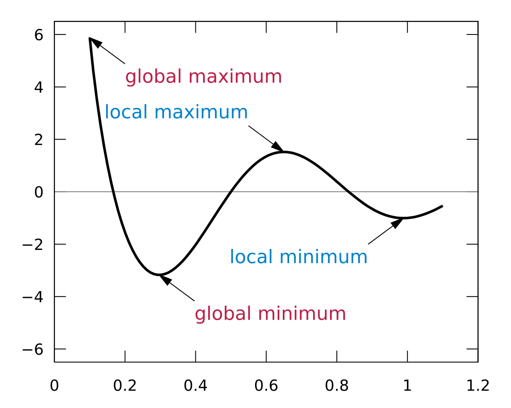
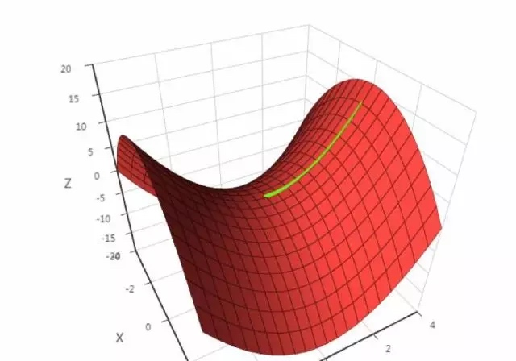

# Gradient Descent

## Optimization Problem

Optimization problem is the problem to find extrema. Extrema (Maxima or minima) definitely locates on the point where gradient equals 0. We can use this approach if a function is differentiable.

Normally, we always deal with minima, since $max: f(x) = min: -f(x)$.

Now, we start with optimization problems ==without constraints==:

Suppose $x^*$ is the **global minima** of a optimization problem, then for all $x$ in the feasible region

$$
f(x^*)\le f(x)
$$

While for the **local minima** $x^*$, there exists a neighborhood $\delta$, for x in this neighborhood
$$
||x-x^*||\le \delta
$$

and also in the feasible region

$$
f(x^*)\le f(x)
$$

Our goal is to find the **global minima** instead of **local minima**. Unfortunately, some functions may have multiple local minimum. So even we find a point where derivate equals 0, we can not be sure that this point is the global minima.

## Derivative and Gradient

### 1. 1st Derivative: Gradient

Now set the gradient of multivariate function as:

$$
\nabla f(x) = \Big(\frac{\partial f}{\partial x_1},\frac{\partial f}{\partial x_2},...,\frac{\partial f}{\partial x_n} \Big)^T
$$

$\nabla$ is gradient operator, it is applied on a multivariate function, and get a vector.

==Example:==

$$\nabla(x^2+xy-y^2)=(2x+y,x-2y)$$

The point where gradient equals 0 is called **stationary point**, or a hypothetical extrema. When reach a extrema, the gradient must be 0, ==but not vice versa==.

### 2. 2nd Derivative: Hessian Matrix

Suppose we found a extrema, how could we determine if it is a minima or maxima?

It is determined by **2nd derivative or Hessian Matrix**:
* if Hessian Matrix is positive definite, then minima;
* if Hessian Matrix is negative definite, then maxima;
* if Hessian Matrix is not definite, further discussion required.

For positive definite, please check [18.06 Notes Symmetric Matrices & Positive Definite](https://github.com/uttgeorge/Linear-Algebra/blob/master/25-Symmetric%20Matrices%20%26%20Positive%20Definitness.pdf).

### 3. Iteration

Sometimes, it is really hard to calculate the minima. We choose a method to approximate the solution, which is iteration. We begin with a point $x_0$, repeat by some rule moving from $x_k$ to $x_{k+1}$ till it converge to the point where gradient is 0.
$$
\lim_{k\rightarrow  +\infty} \nabla f(x_k) = 0
$$ 

So the key issue here is to find a iterative function to find the next point, based on 1st derivative (**Gradient**) and 2nd derivative (**Hessian Matrix**).

$$
x_{k+1} = h(x_k)
$$

## Gradient Descent

<!--
_**1. One Dimensional (one variable) function**_

The Taylor polynomial of a differentiable function:
$$
f(x+\Delta x)= f(x)+f'(x)\Delta x+\frac{1}{2}f''(x_0)(\Delta x)^2+...+\frac{1}{n!}f^{(n)}(x)(\Delta x)^n...

_**Multi-variables function**_
$$-->

### 1. Direction of Gradient Descent

The Taylor polynomial of a differentiable function at point $x$:

$$
f(X+ \Delta x)= f(X)+(\nabla f(X))^T\Delta x + o(\Delta x)
$$

The relationship between increment of function, $\Delta x$ and gradient can be shown as:

$$
    f(x+\Delta x)-f(x) = (\nabla f(X))^T\Delta x + o(\Delta x)
$$ 

If $\Delta x$ is small enough, we can simply ignore quadratic term and higher-dimensional terms:

$$
    f(x+\Delta x)-f(x) \approx (\nabla f(X))^T\Delta x 
$$

where $\Delta x$ is a vector with infinite directions. To which direction should we go? 

If we can make sure that:

$$
(\nabla f(X))^T\Delta x < 0
$$

then:

$$
f(x+\Delta x)<f(x)
$$

the function decrease progressively. That is the right direction we should go. 

And since we know that: 

$$(\nabla f(X))^T\Delta x=\left \| \nabla f(X) \right \|\left \| \nabla \Delta x \right \| cos\theta$$

where $\left \| \cdot \right \|$ is the norm of vector, $\theta$ is the angle between vector $\nabla f(X)$ and vector $\Delta x$. Since norm is non-negative, if $cos \theta \le 0$, then $(\nabla f(X))^T\Delta x \le 0$ always holds.

$cos \theta \le 0$ reach its minima -1 at $\theta = \pi$. In other words, $\Delta x$ and gradient are in opposite direction.

$$
(\nabla f(X))^T\Delta x = -\left \| \nabla f(X) \right \|\left \| \nabla \Delta x \right \|
$$

Now set:
$$
\Delta x = -\alpha \nabla f(X), \alpha > 0
$$

So that:
$$
(\nabla f(X))^T\Delta x=-\alpha (\nabla f(X))^T(\nabla f(X))<0
$$

==The function decreases faster on the opposite direction of gradient.==

### 2. Learning Rate

If we set $\Delta x = -\nabla f(X)$, $x+\Delta x$ may be out of the neighbor, in other words, $\left \| x-x^* \right \| > \delta$ . In this case, we can not ignore quadratic term for approximation. So we set a learning rate that is between 0 and 1 to make sure $\left \| x-x^* \right \| \le \delta$ , then we can ignore higher terms.

==So we get:==

$$
x_{k+1}=x_k-\alpha \nabla f(x_k)
$$

## Problems

### 1. Local Minimum

### 2. Saddle Points

Points where gradients equal to 0 but neither local minimum nor global minimum. Hessian Matrix is neither positive definite nor negative definite.

## Improvements
### 1. Stochastic Gradient Descent
### 2. Mini-batch Gradient Descent

## Advanced Gradient Descent Algorithms

### 1. Momentum

### 2. Adagrad: adaptive gradient

### 3. AdaDelta

### 4. Adam: adaptive moment estimation

## References

Wikipedia

SIGAI-AI
